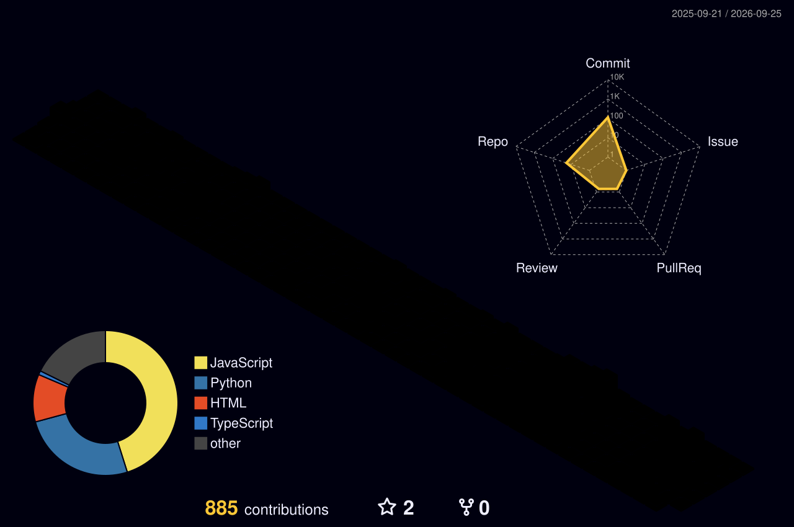

<!-- ═══════════════════════════ ANIMATED HERO ═══════════════════════════ -->

  
  
  
  

  
  
  
  

<!-- ═══════════════════════════ ABOUT ═══════════════════════════ -->

I'm **Ram** — a Computer Science engineering student and full-stack developer who enjoys turning
real-world problems into working software. I care about the **why** behind the code:
clean architecture, thoughtful UX, and products that people can actually use.

- 🔭 **Currently building** — production SaaS at **[ShipCube](https://shipcube.com)** (Clockie — a multi-tenant HR platform), plus my own products like [**Tribal Mart**](https://github.com/RAmPAtel007/Tribal-Mart-V2) (a MERN + AI marketplace)
- 🧠 **Focused on** — backend architecture, REST API design, and applied AI (LLM-powered features)
- 🌱 **Sharpening** — Data Structures & Algorithms and System Design
- 🎓 **B.Tech in Computer Science** — Acropolis Institute of Technology and Research, Indore
- 🤝 **Open to** — Software Engineering internships & collaboration on interesting projects
- ⚡ **Motto** — *build solutions, not just code*

<!-- ═══════════════════════════ PROFESSIONAL WORK ═══════════════════════════ -->

> Production SaaS built with the **[ShipCube](https://shipcube.com)** team, where I'm one of the top contributors — both are **live, in-production products**.

<table>
<tr>
<td width="50%" valign="top">

### 🕐 [Clockie](https://clockie.ai) &nbsp;`▶ Live`
A **multi-tenant HR & operations SaaS** — one isolated workspace per company for attendance
(GPS-verified punch-in), leave, payroll, real-time chat, tasks & documents. Self-serve onboarding,
free-trial → subscription gating, installable as a **PWA** with push notifications.

`Next.js 16` · `TypeScript` · `Firebase` · `Tailwind` · `Stripe`

**Core contributor — 365 commits** &nbsp;·&nbsp; [**`▶ Live`**](https://clockie.ai) &nbsp;·&nbsp; `🔒 private repo`

</td>
<td width="50%" valign="top">

### 📣 [ShipCube OutreachHub](https://outreachhub.shipcubeai.com) &nbsp;`▶ Live`
An **AI-powered, multi-agent outreach & marketing-automation platform** on Google Cloud —
automated research analysis and personalized outreach generation with **Vertex AI Gemini**,
orchestrated via Cloud Scheduler with full reporting.

`Python` · `Flask` · `PostgreSQL` · `Vertex AI Gemini` · `GCP` · `SQLAlchemy`

**Core contributor — 283 commits** &nbsp;·&nbsp; [**`▶ Live`**](https://outreachhub.shipcubeai.com) &nbsp;·&nbsp; `🔒 private repo`

</td>
</tr>
</table>

<!-- ═══════════════════════════ FEATURED PROJECTS ═══════════════════════════ -->

<i>Personal builds & hackathon projects</i>

<table>
<tr>
<td width="50%" valign="top">

### 🪔 [Tribal Mart](https://github.com/RAmPAtel007/Tribal-Mart-V2)
A full-stack marketplace connecting India's tribal cooperatives with buyers. Introduces a
**three-sided model** (buyer · seller · **agent**) so artisans who can't run a storefront still
reach the world — plus a Hindi/English switcher and **Saathi**, a Gemini-powered shopping assistant.

`React 19` · `Node/Express` · `MongoDB` · `Gemini AI` · `Razorpay` · `Cloudinary`

[**`</> Code`**](https://github.com/RAmPAtel007/Tribal-Mart-V2)

</td>
<td width="50%" valign="top">

### 🛰️ [AirGuard AI](https://github.com/RAmPAtel007/ET-AI)
Urban air-quality intelligence for smart cities — not just *what* the air is, but *why* and *what to do*.
Fuses monitoring stations, satellite fire data & meteorology into **source attribution**, a 72-hour
forecast, and auto-generated **GRAP enforcement orders**.

`Python` · `Flask` · `MapLibre GL` · `Google Gemini`

[**`</> Code`**](https://github.com/RAmPAtel007/ET-AI)

</td>
</tr>
<tr>
<td width="50%" valign="top">

### 🔎 [Acquisition Lens](https://github.com/RAmPAtel007/acquisition-lens)
Rescores M&A lead lists for **buyers** instead of sellers — grading each company on succession,
buy-box fit, AI-upside, acquirability & path-to-owner, with the **verbatim evidence** behind every
score. Ships with CI/CD and an MIT license.

`Python` · `Data Enrichment` · `CI/CD` · `LLM Scoring`

[**`</> Code`**](https://github.com/RAmPAtel007/acquisition-lens)

</td>
<td width="50%" valign="top">

### 💹 [FinanceAI Dashboard](https://github.com/RAmPAtel007/finance-dashboard)
A premium personal-finance dashboard with interactive charts, AI insights, and role-based access —
backed by a clean **layered REST API** (JWT auth, RBAC, Zod validation) built as a separate service.

`React` · `Vite` · `Recharts` · `Node/Express` · `SQLite` · `JWT`

[**`▶ Live`**](https://finance-dashboard-ashy-zeta.vercel.app) · [**`</> Web`**](https://github.com/RAmPAtel007/finance-dashboard) · [**`⚙ API`**](https://github.com/RAmPAtel007/finance-backend)

</td>
</tr>
<tr>
<td width="50%" valign="top">

### 📈 [Order → Net Positions](https://github.com/RAmPAtel007/order-position-system)
A two-service trading pipeline: one service streams & validates order updates at a capped rate, the
other applies them to **idempotent in-memory net positions** served over HTTP. A clean study in
event processing & service design.

`Python` · `REST` · `Event Streaming` · `Systems Design`

[**`</> Code`**](https://github.com/RAmPAtel007/order-position-system)

</td>
<td width="50%" valign="top">

### 🛡️ [AI Fraud Detection](https://github.com/RAmPAtel007/ai-fraud-detection-insurance)
A TypeScript web app exploring **AI-assisted insurance fraud detection** — flagging suspicious
claims through a modern, data-driven interface.

`TypeScript` · `React` · `AI/ML`

[**`</> Code`**](https://github.com/RAmPAtel007/ai-fraud-detection-insurance)

</td>
</tr>
</table>

<a href="https://github.com/RAmPAtel007?tab=repositories"><b>→ See all 30+ repositories</b></a>

<!-- ═══════════════════════════ TECH STACK ═══════════════════════════ -->

<table align="center">
<tr><td align="center"><b>Languages</b></td><td>

</td></tr>
<tr><td align="center"><b>Frontend</b></td><td>

</td></tr>
<tr><td align="center"><b>Backend</b></td><td>

</td></tr>
<tr><td align="center"><b>Database</b></td><td>

</td></tr>
<tr><td align="center"><b>Tools & AI</b></td><td>

&nbsp;
&nbsp;
</td></tr>
</table>

<!-- ═══════════════════════════ GITHUB ANALYTICS ═══════════════════════════ -->

<!-- Real-world impact — verified numbers that public widgets can't see (private production repos) -->

  

<!-- 3D contribution skyline (generated daily by .github/workflows/profile-3d.yml) -->

  

  
  

<!-- Contribution snake (auto-generated by the Platane/snk GitHub Action on your profile repo) -->

  

<!-- ═══════════════════════════ CONNECT ═══════════════════════════ -->

  
  
  

<i>💡 Open to internships, freelance builds, and collaborating on projects that solve real problems. Let's build something.</i>

<!-- ═══════════════════════════ ANIMATED FOOTER ═══════════════════════════ -->

